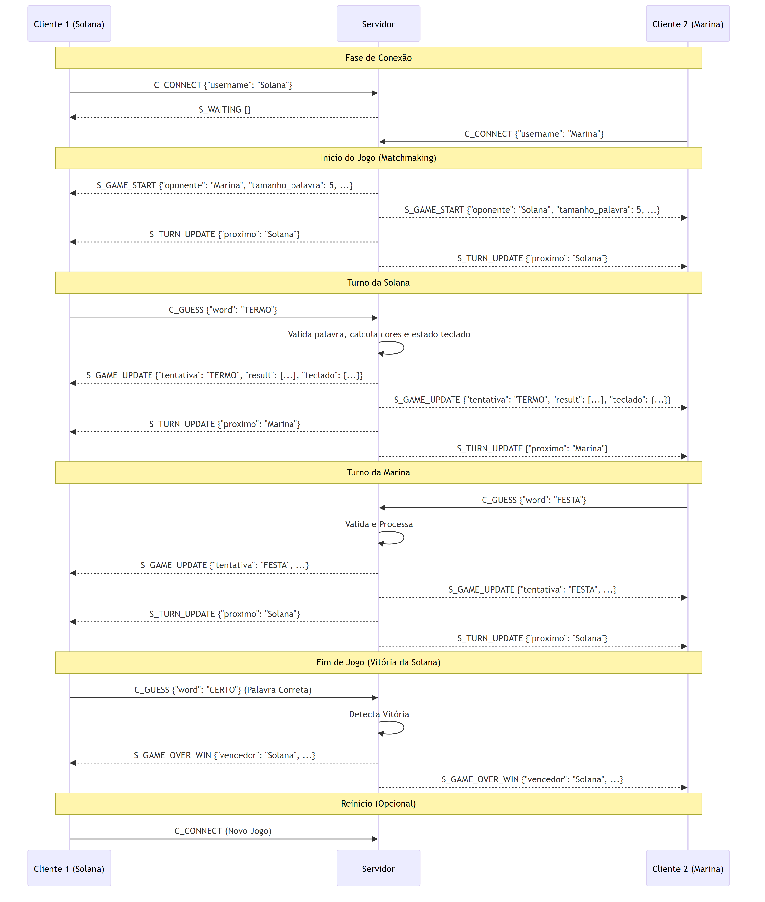

# Termo Competitivo - Aplicação Distribuída C/S

<p align="center">
  
  
  
  
  
</p>

---

## Projeto: Termo Competitivo

Este repositório contém o código-fonte de um jogo multiplayer de adivinhação de palavras, **"Termo Competitivo"**, desenvolvido pela aluna **Solana Marina Bonfim Lemos** como um projeto da  disciplina **DEC000098 - Redes de Computadores I** da **Universidade estadual de Santa Cruz - UESC**. A aplicação segue um modelo cliente-servidor, onde um servidor centralizado em Python gerencia a lógica do jogo e múltiplos clientes se conectam para competir.

---

### 1. Documentação do Software

#### 1.1. Propósito do Software

O propósito principal deste software é demonstrar, de forma prática, os conceitos fundamentais de programação de redes e sistemas distribuídos.

Objetivos:

* Implementar a comunicação cliente-servidor usando Sockets TCP.
* Projetar e documentar um protocolo de camada de aplicação personalizado (baseado em JSON) para gerenciar o estado do jogo.
* Lidar com concorrência no servidor (usando threading para múltiplos clientes) e no cliente (usando threading e queue para manter uma GUI responsiva).
* Separar claramente as responsabilidades: um servidor "inteligente" (stateful) e clientes "burros" (stateless).

#### 1.2. Motivação da Escolha do Protocolo de Transporte (TCP)

Para este jogo, o TCP foi escolhido em detrimento do UDP por três motivos cruciais:

1. **Confiabilidade:** O jogo é baseado em turnos e depende 100% da entrega de cada mensagem. A perda de um único pacote C_GUESS (contendo a tentativa de um jogador) ou S_GAME_UPDATE (contendo o resultado) corromperia o estado do jogo para ambos os jogadores. O TCP garante que todos os pacotes sejam entregues.

2. **Ordenação:** As mensagens devem chegar na ordem exata em que foram enviadas. Uma tentativa do "Jogador 2" não pode chegar ao servidor antes da tentativa do "Jogador 1" no turno anterior. O TCP garante a ordenação dos pacotes, o que simplifica a lógica de gerenciamento de turnos no servidor.

3. **Tolerância à Latência:** A pequena latência adicional introduzida pelo TCP e seu controle de fluxo é irrelevante para um jogo de palavras por turnos, onde os milissegundos não afetam a jogabilidade. A confiabilidade é muito mais importante que a velocidade de entrega do UDP.

#### 1.3. Funcionamento do Software (Arquitetura)

A aplicação é dividida em dois componentes principais que se comunicam pela rede.

##### Servidor

O servidor é o "cérebro" do jogo. Ele não possui interface gráfica e sua única responsabilidade é gerenciar o estado dos jogos.

* **Concorrência:** O servidor usa a biblioteca `threading`. O loop principal do servidor apenas aceita novas conexões (`socket.accept()`). Cada nova conexão de cliente é entregue a uma nova thread (`handle_client`), permitindo que o servidor gerencie dezenas de clientes simultaneamente.

* **Matchmaking:** Clientes que se conectam são colocados em uma fila de espera. Quando dois clientes estão na fila, eles são removidos e agrupados.

* **Gerenciamento de Estado:** Para cada par de jogadores, uma instância da classe `Jogo` é criada. Esta classe armazena:

  * A palavra secreta.
  * O número máximo de tentativas (calculado como `len(palavra) + 1`).
  * A lista de tentativas já feitas.
  * De quem é o turno atual.

* **Lógica:** Quando o servidor recebe uma tentativa (C_GUESS), ele a normaliza (ex: "MAÇÃ" -> "maca"), processa usando `logica.py`, recalcula o estado do teclado (`logica.calcular_estado_teclado`), e envia o resultado (S_GAME_UPDATE) para ambos os jogadores na sala.

##### Cliente

O cliente é a interface visual com a qual o jogador interage. Ele é intencionalmente "burro" (stateless), ou seja, não contém lógica de jogo e apenas desenha o que o servidor lhe envia.

* **Máquina de Estados:** O cliente opera em uma máquina de estados:

  * `LOGIN`: Solicita o nome do jogador.
  * `WAITING`: Conecta ao servidor e aguarda a mensagem `S_GAME_START`.
  * `PLAYING`: O jogo principal, onde o jogador envia tentativas (`C_GUESS`) quando é seu turno (`meu_turno = True`).
  * `GAME_OVER`: Mostra o resultado final e o botão "Jogar Novamente".

* **Concorrência (GUI + Rede):** O cliente usa `threading` e `queue` para evitar que a interface gráfica (Pygame) congele:

  * **Thread Principal:** Roda o loop do Pygame, desenha o grid/teclado e captura inputs (mouse/teclado).
  * **Thread de Rede (`rede_cliente.py`):** Roda em segundo plano. Ela é a única que lida com a rede. Ela fica "travada", esperando mensagens do servidor.

* **Comunicação (Fila):** Quando a Thread de Rede recebe uma mensagem (ex: `S_GAME_UPDATE`), ela não tenta desenhar. Em vez disso, ela coloca a mensagem JSON em uma fila. A Thread Principal verifica essa fila a cada frame, processa as mensagens e atualiza a tela.

#### 1.4. Requisitos Mínimos

**Servidor:**

* Python 3.x
* Acesso ao arquivo `palavras.txt`.
* Conexão de rede estável com uma porta (ex: 12345) aberta e acessível aos clientes.
* Permissão do firewall

**Cliente:**

* Python 3.x
* Biblioteca Pygame: `pip install pygame`
* Conexão de rede com o servidor.
* Permissão do firewall

---

### 2. Protocolo da Camada de Aplicação

O protocolo define como o cliente e o servidor se comunicam.

#### 2.1. Formato e Transporte

* **Transporte:** As mensagens são trocadas sobre um soquete TCP.
* **Formato:** As mensagens são objetos JSON serializados para string.
* **Delimitador:** Cada mensagem JSON é terminada por um caractere de nova linha (`
  `). Isso permite que o receptor separe múltiplas mensagens que podem chegar no mesmo pacote TCP.

**Estrutura Padrão da Mensagem:**

```json
{"tipo": "NOME_DA_MENSAGEM", "payload": { ...dados... }}
```

#### 2.2. Fluxo de Estados e Mensagens

Um jogo típico segue este fluxo:

**Conexão:**

* Cliente 1 -> `C_CONNECT` (com `username="JogadorA"`)
* Servidor -> `S_WAITING` (para Cliente 1)
* Cliente 2 -> `C_CONNECT` (com `username="JogadorB"`)

**Início do Jogo:**

* O servidor forma o par.
* Servidor -> `S_GAME_START` (para Cliente 1, com `oponente="JogadorB"`)
* Servidor -> `S_GAME_START` (para Cliente 2, com `oponente="JogadorA"`)
* Servidor -> `S_TURN_UPDATE` (para ambos, informando que é a vez do `JogadorA`)

**Turno de Jogo:**

* Cliente 1 -> `C_GUESS` (com `word="SORTE"`)
* Servidor processa.
* Servidor -> `S_GAME_UPDATE` (para ambos, com o resultado de "SORTE" e o estado do teclado)

(Agora é a vez do Jogador B)

* Cliente 2 -> `C_GUESS` (com `word="TERMO"`)
* Servidor processa.
* Servidor -> `S_GAME_UPDATE` (para ambos, com o resultado de "TERMO")

**Fim de Jogo (Vitória):**

* Cliente 1 -> `C_GUESS` (com `word="CASAS"`)
* Servidor processa e detecta a vitória.
* Servidor -> `S_GAME_OVER_WIN` (para ambos, com `vencedor_username="JogadorA"`)

**Fim de Jogo (Desconexão):**

* Cliente 2 fecha a janela abruptamente.
* A `handle_client` do Cliente 2 no servidor detecta a desconexão.
* O servidor encerra a sala de jogo.
* Servidor -> `S_ERROR` (para Cliente 1, com `mensagem="Oponente desconectou..."`)

#### 2.3. Dicionário de Mensagens

**Mensagens Cliente -> Servidor (C2S)**

**C_CONNECT**

* **Quando:** Enviada pelo cliente imediatamente após estabelecer a conexão TCP.
* **Propósito:** Registrar o jogador no servidor e entrar na fila de matchmaking.
* **Payload:**

```json
{"username": "nome_do_jogador"}
```

**C_GUESS**

* **Quando:** Enviada pelo cliente quando é seu turno e ele envia uma tentativa.
* **Propósito:** Enviar a palavra para o servidor processar.
* **Payload:**

```json
{"word": "MACA"}
```

**Mensagens Servidor -> Cliente (S2C)**

**S_WAITING**

* **Quando:** Enviada ao cliente se ele for o primeiro a entrar na fila.
* **Propósito:** Informar ao cliente para exibir a tela "Aguardando Oponente".
* **Payload:**

```json
{}
```

**S_GAME_START**

* **Quando:** Enviada para ambos os clientes quando um par é formado.
* **Propósito:** Iniciar o jogo, informando o oponente, o tamanho da palavra e o número de tentativas (calculado como tamanho + 1).
* **Payload:**

```json
{
  "oponente": "NomeDoOponente",
  "tamanho_palavra": 5,
  "max_tentativas": 6,
  "seu_turno_num": 1 
}
```

**S_TURN_UPDATE**

* **Quando:** Enviada após o `S_GAME_START` (para definir o primeiro jogador) e após cada `S_GAME_UPDATE`.
* **Propósito:** Informar a ambos os clientes de quem é a vez de jogar.
* **Payload:**

```json
{"proximo_turno_username": "nome_do_jogador_da_vez"}
```

**S_GAME_UPDATE**

* **Quando:** Enviada para ambos os clientes após uma tentativa válida.
* **Propósito:** A mensagem principal do jogo. Envia o resultado da última jogada, o estado completo e calculado do teclado, e de quem é o próximo turno.
* **Payload:**

```json
{
  "jogador_que_jogou": "JogadorA",
  "tentativa": ["maca", ["cinza", "amarelo", "cinza", "verde"]],
  "estado_teclado": {
    "a": "verde",
    "m": "cinza",
    "c": "amarelo",
    "z": "neutro",
     ...
  },
  "proximo_turno_username": "JogadorB"
}
```

**S_GAME_OVER_WIN**

* **Quando:** Enviada para ambos os clientes quando um jogador acerta a palavra.
* **Propósito:** Encerrar o jogo com um vencedor.
* **Payload:**

```json
{
  "vencedor_username": "JogadorA",
  "palavra_secreta": "casa",
  "ultima_tentativa": ["casa", ["verde", "verde", "verde", "verde"]],
  "estado_teclado": { ... }
}
```

**S_GAME_OVER_DRAW**

* **Quando:** Enviada para ambos os clientes se as `max_tentativas` acabarem.
* **Propósito:** Encerrar o jogo como empate.
* **Payload:**

```json
{
  "palavra_secreta": "casa",
  "ultima_tentativa": ["navio", ["cinza", "amarelo", "cinza", "cinza"]],
  "estado_teclado": { ... }
}
```

**S_ERROR**

* **Quando:** Enviada para um cliente específico (erro de turno) ou para ambos (erro fatal do jogo).
* **Propósito:** Informar sobre um erro. O cliente (GUI) usa a string "desconectou" para tratar o fim abrupto do jogo.
* **Payload:**

```json
{"mensagem": "Não é o seu turno."}
```

ou

```json
{"mensagem": "Oponente JogadorB desconectou. O jogo foi encerrado."}
```

**S_ERROR_FATAL (Mensagem interna do cliente)**

* **Quando:** Gerada pelo `rede_cliente.py` (não pelo servidor) se a conexão TCP não puder ser estabelecida.
* **Propósito:** Informar a GUI que o servidor está offline.
* **Payload:**

```json
{"mensagem": "Não foi possível conectar ao servidor."}
```

#### 2.4. Diagrama de Sequência (Fluxo de Mensagens)

O diagrama abaixo ilustra a troca de mensagens desde a conexão até o fim do jogo.


